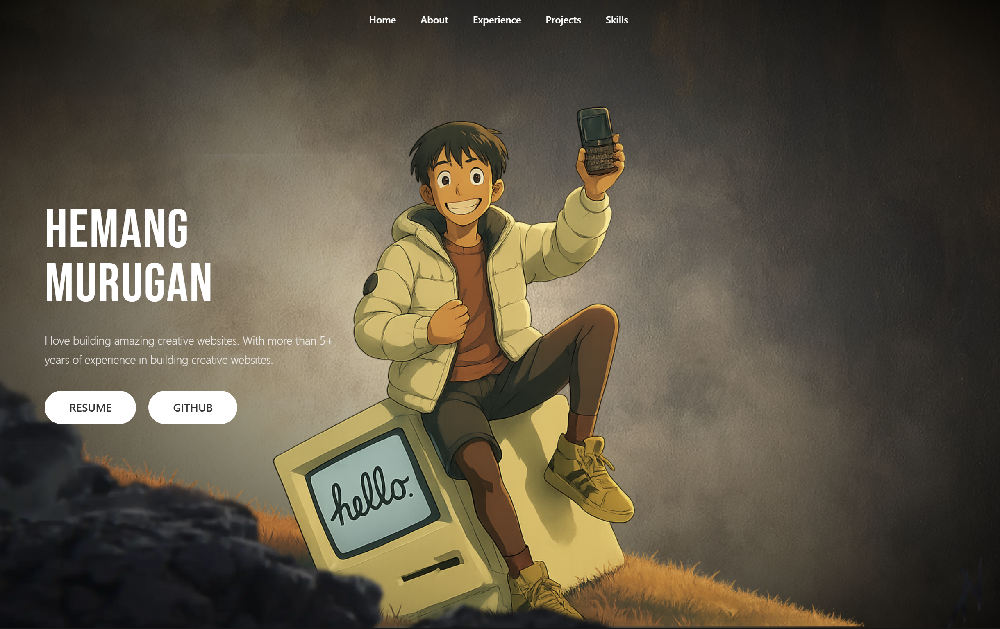
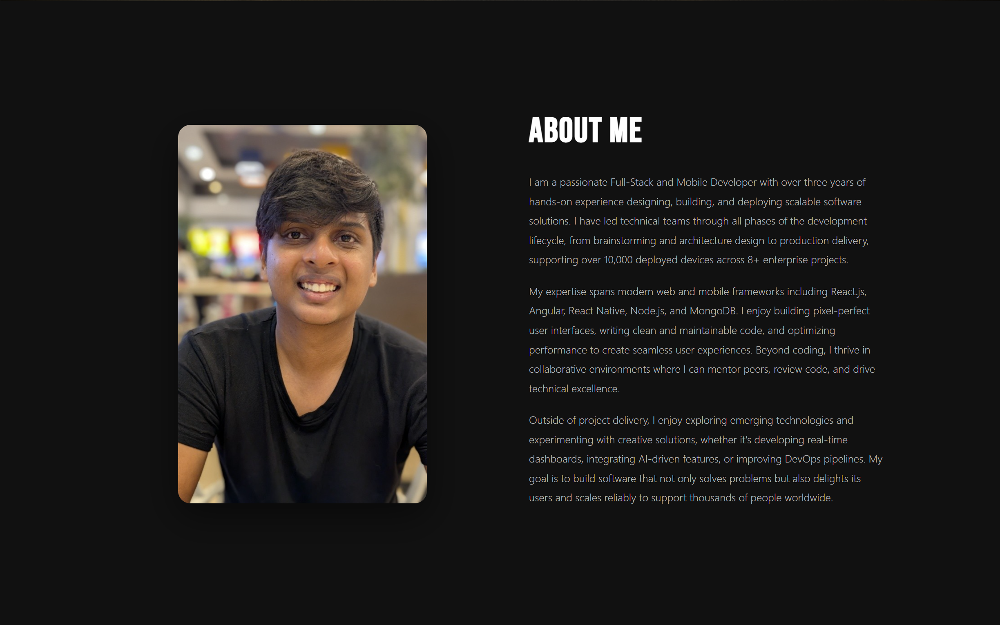
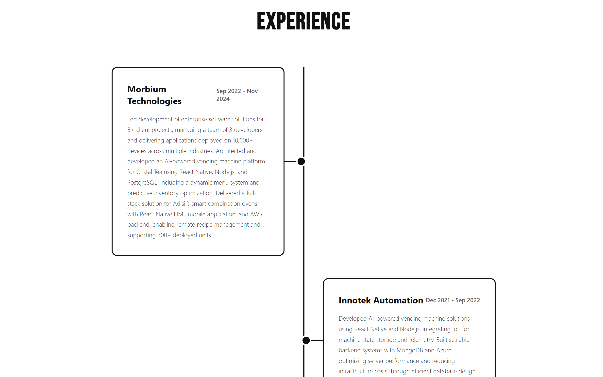
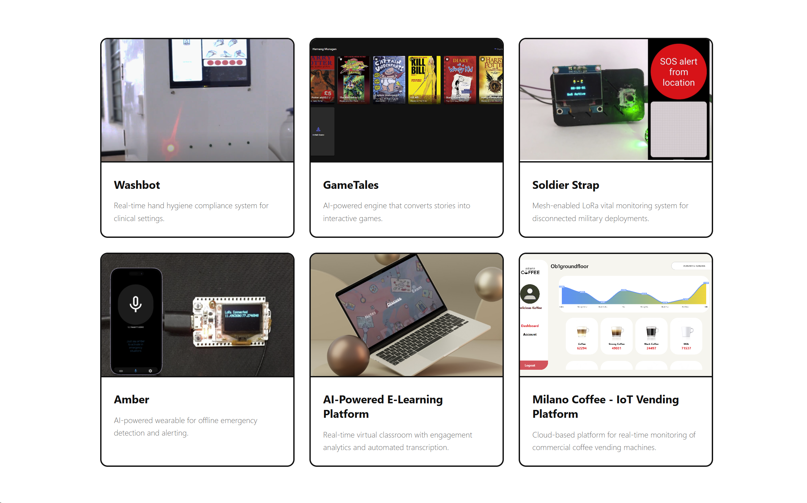
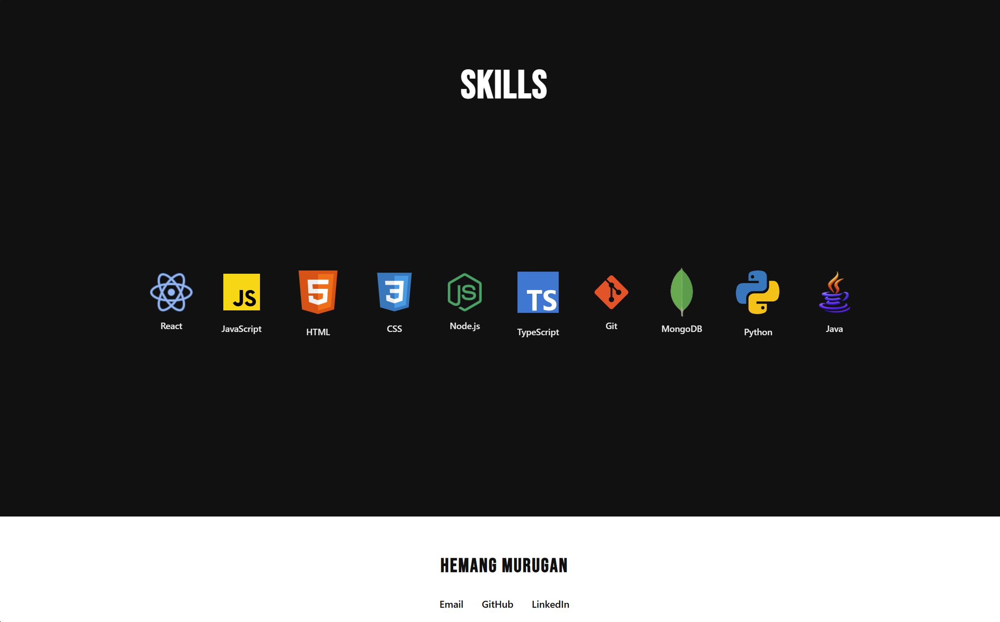
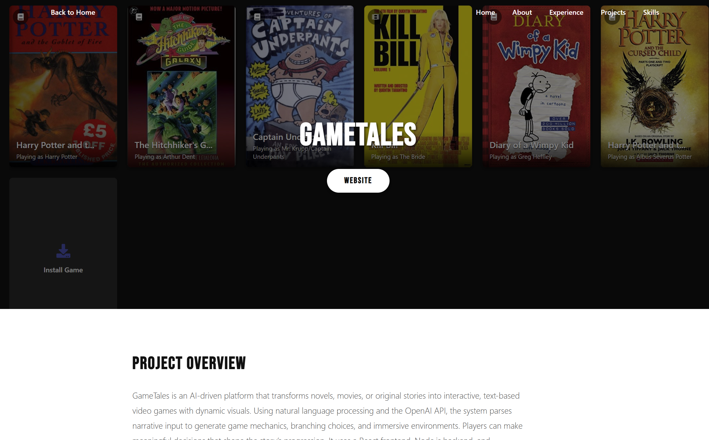
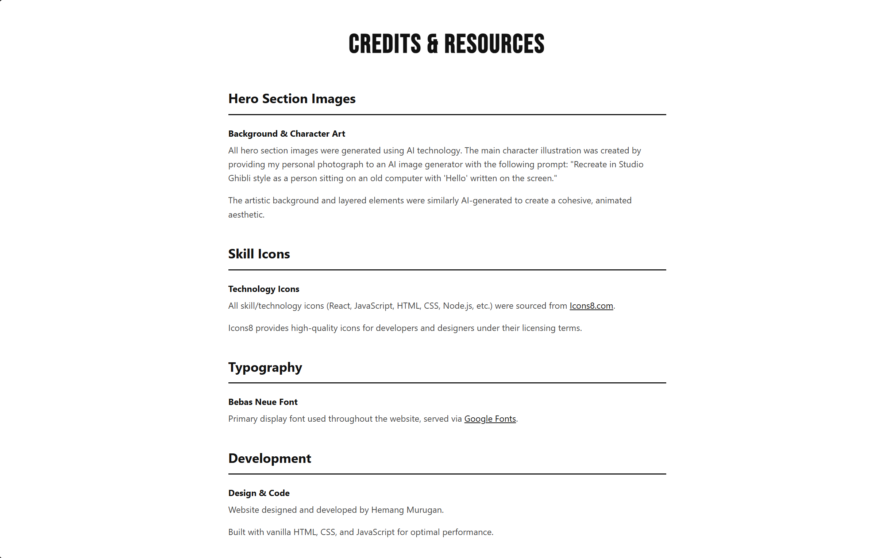

# 🌐 Homepage Project

## 📌 Author & Class Info

- **Author:** Hemang Murugan
- **Class:** Web Development — Northeastern University
- **Date:** September 2025

---

## 🎯 Project Objective

This project is a personal homepage built using **HTML5**, **CSS3**, and **ES6+ JavaScript** (front-end only).  
It showcases my background, skills, and projects through a clean, responsive design.  
Key features:

- **Creative parallax hero section** for a unique look and feel.
- **Dynamic project gallery** and a **credits page** for proper attribution.
- Fully W3C-compliant, ESLint + Prettier formatted, and deployed publicly.

---

## 📷 Screenshots

| Page         | Screenshot                                  |
| ------------ | ------------------------------------------- |
| Homepage     |          |
| About        |            |
| Experience   |  |
| Projects     |      |
| Skills       |          |
| Project Page |       |
| Credits      |        |

---

## Presentation Link

[Powerpoint](https://docs.google.com/presentation/d/1ymRFuoSfOCDvY3wGYOEHRHNAR8olaLGQh1wlXMfCBn0/edit?usp=sharing)

---

## 🛠️ Instructions to Build / Run

1. Clone the repository
   ```bash
   git clone https://github.com/iamtheretronerd/webdev-portfolio-assignment
   cd homepage-project
   ```
2. Install dev dependencies
   ```bash
   npm install
   ```
3. Run a local development server
   ```bash
   npx lite-server
   ```
4. Open `http://localhost:3000` in your browser.

---

## ✅ Assignment Rubric Checklist

| **Criteria**                                                      | **Link / Verification**                                                                                        |
| ----------------------------------------------------------------- | -------------------------------------------------------------------------------------------------------------- |
| Design Document (Project Description, Personas, Stories, Mockups) | [View PDF](./submissions/Design-Document.pdf)                                                                  |
| Homepage Includes Meaningful Information                          | ✔ (See [index.html](./index.html))                                                                            |
| Uses ES6 Modules                                                  | ✔ (`type: "module"` in [index.html](./index.html) & [package.json](./package.json))                           |
| Deployed Publicly                                                 | [Live Site](https://hemangmurugan.netlify.app)                                                                 |
| Creative Original Component                                       | Parallax hero section + animated project grid                                                                  |
| CSS / JS / Images Organized in Folders                            | ✔ ([/css](./css/), [/js](./js/), [/img](./img/))                                                              |
| Meta Information (author, description, icon)                      | ✔ (Check `<head>` of all pages)                                                                               |
| Original JS Functionality (>5 LOC)                                | [main.js](./js/main.js) — Data loaded and displayed from JSON pages. Parallax control and mouse scroll effects |
| Formatted with Prettier                                           | ✔ (`npm run format` used before submission)                                                                   |
| W3C Compliant                                                     | ✔ (Validated at [validator.w3.org](https://validator.w3.org/))                                                |
| ESLint Clean                                                      | ✔ (`npm run lint` → 0 errors)                                                                                 |
| Images Have `alt`                                                 | ✔ (verified in all pages)                                                                                     |
| ≥ 2 HTML Pages                                                    | ✔ ([index.html](./index.html), [project.html](./project.html), [credits.html](./credits.html))                |
| Classes Used for Identifying Elements                             | ✔ (semantic class names like `.hero`, `.project-card`)                                                        |
| No Non-Standard Tags                                              | ✔ (`<button>`, `<nav>`, `<main>` used properly)                                                               |
| CSS Organized & No `!important`                                   | ✔                                                                                                             |
| Uses Flexbox / Grid                                               | ✔ (see `.project-grid` in [main.css](./css/main.css))                                                         |
| README (author, class, objective, screenshot, build)              | ✔ (this file)                                                                                                 |
| package.json with Dependencies                                    | [package.json](./package.json)                                                                                 |
| MIT License                                                       | [LICENSE](./LICENSE)                                                                                           |
| Short Narrated Video                                              | [Watch Here](https://youtu.be/PmONKyX-Sqw)                                                                   |
| Google Form Submission                                            | ✔ (Thumbnail + links verified)                                                                                |
| GenAI Usage Disclosure                                            | See section below                                                                                              |

---

## GenAI Usage

This project used GenAI tools for brainstorming, creative asset generation, and code reviews.

- **Model Used:** Claude (Opus) — September 2025 version
- **Prompts Used:**

  1. _"Recreate in Studio Ghibli style as a person sitting on an old computer with 'Hello' written on the screen."_ — used to generate concept art inspiration for the hero section theme.
  2. _"Review my index.html and main.css for semantic structure, accessibility issues, and best practices."_ — used to identify improvements and ensure the page passed W3C validation.

- **Validation:** All outputs were manually reviewed, iterated, and integrated into the project only after confirming they followed semantic HTML5, accessibility, and ESLint/Prettier standards.

## Copyrights & Attributions

This project contains a mix of original work, AI-generated assets, and third-party resources.

- **Hero Section Images:**  
  Generated using GenAI (Gemini Nano Banana) based on custom prompts for a Studio Ghibli-inspired aesthetic.
- **Skills Section Icons:**  
  Sourced from [Icons8](https://icons8.com/) under their free license.
- **index.html & project.html:**  
  Fully hand-coded by me, following semantic HTML5 and responsive design best practices.
- **credits.html:**  
   Generated with AI assistance using the following sample prompt:

  > _"Generate a clean HTML credits page listing acknowledgments, image attributions, and technology stack used in a professional portfolio site."_

  A full list of asset sources, icon credits, and licenses can be found here:  
  🔗 **[Credits Page](https://hemangmurugan.netlify.app/credits.html)**

All AI-generated code and images were manually reviewed, edited, and optimized before inclusion to ensure compliance with accessibility and project requirements.
#
